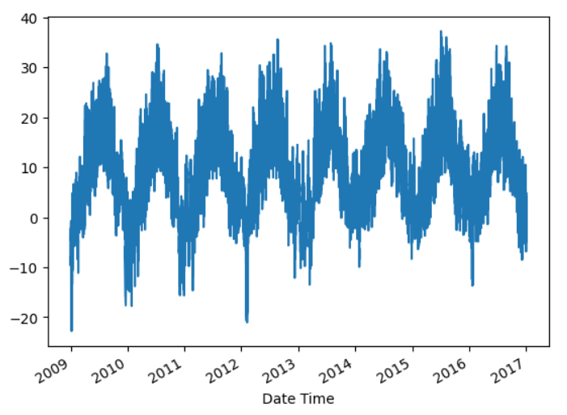
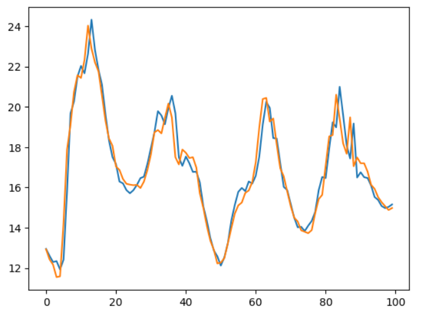
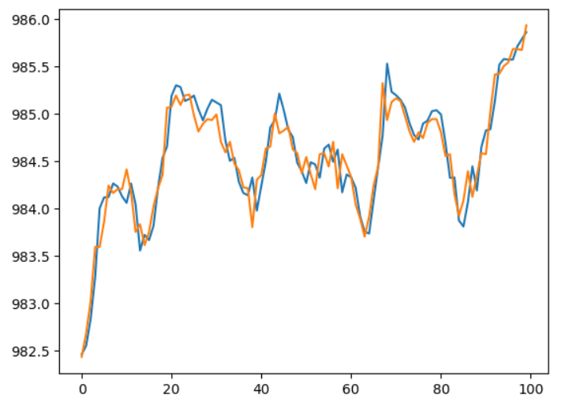

# Time Series Forecasting

## Overview

This project implements a Long Short-Term Memory (LSTM) neural network for weather forecasting using historical weather data. The model learns temporal patterns from past observations and predicts future weather attributes such as temperature and atmospheric pressure.

The project demonstrates the complete machine learning workflow, including data preprocessing, sequence generation, model training, prediction, and evaluation using TensorFlow and Keras.

---

## Features

* Data preprocessing and normalization
* Time-series sequence generation
* LSTM-based forecasting model
* Temperature prediction
* Atmospheric pressure prediction
* Visualization of predictions against actual values
* Performance evaluation on unseen test data

---

## Dataset

The project uses historical weather data stored in:

```text
weather_data.csv
```

The dataset contains weather observations recorded over multiple years, including:

* Date and time
* Temperature
* Atmospheric pressure

---

## Technologies Used

* Python
* Pandas
* NumPy
* Matplotlib
* TensorFlow
* Keras
* Scikit-Learn
* Jupyter Notebook

---

## Project Workflow

1. Load and preprocess weather data
2. Create time-series sequences
3. Split data into training, validation, and testing sets
4. Train LSTM models
5. Generate forecasts
6. Compare predictions with actual values
7. Visualize forecasting performance

---

## Repository Structure

```text
Time_Series_Forecasting/
│
├── Weather.ipynb
├── weather_data.csv
├── README.md
├── temperature_trend.png
├── forecast.png
└── pressure_forecast.png
```

---

## Dataset Temperature Trend



The graph illustrates historical temperature variations over time and highlights seasonal trends present in the dataset.

---

## Temperature Forecast Results



Comparison between actual and predicted temperature values generated by the trained LSTM model.

---

## Pressure Forecast Results



Comparison between actual and predicted atmospheric pressure values on the test dataset.

---

## Results

The trained LSTM model successfully captures temporal patterns in the weather data and produces forecasts that closely follow the actual observations. The prediction plots demonstrate the model's ability to learn long-term dependencies present in time-series data.

---
